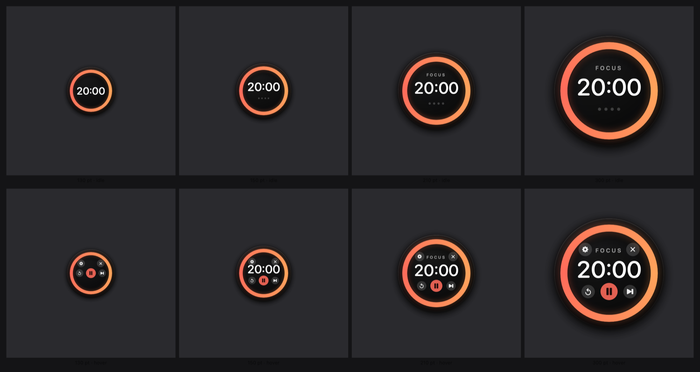
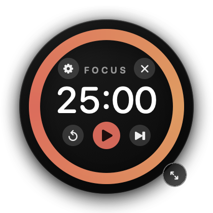
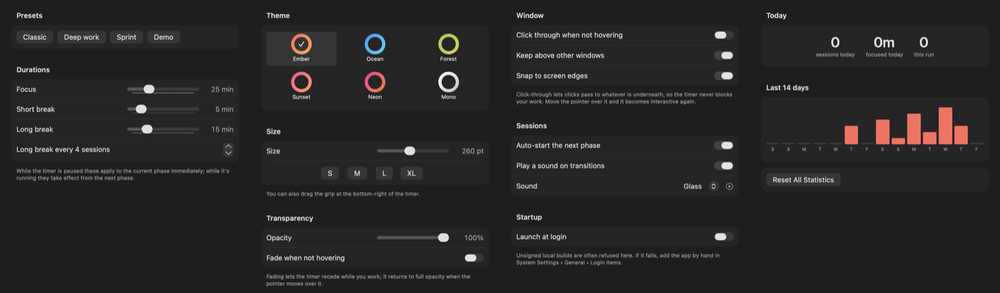

# overlay_promodoro

[](https://github.com/t3chw/overlay_promodoro/actions/workflows/ci.yml)

A floating Pomodoro timer for macOS that stays on top of everything — including
other apps' full-screen spaces — without stealing focus.

No Dock icon, no app switcher entry, no permissions to grant. Just a dial that
sits above your work and counts down.



## What it does

- **Always on top.** Floats above every ordinary window and follows you across
  Spaces, including into another app's native full-screen space.
- **Never steals focus.** Clicking it does not deactivate your editor.
- **A ring that empties in real time.** The arc redraws at display rate while
  running, so it sweeps smoothly rather than stepping once a second.
- **Can't drift.** The countdown is derived from an absolute end timestamp, not
  accumulated per tick, so it survives the Mac sleeping mid-session — close the
  lid for ten minutes during a 25-minute block and it knows.
- **Optional click-through.** Clicks pass to whatever is underneath until you
  move the pointer over the dial, so it never blocks your work.
- **Resizable** from 130 to 420pt by dragging the corner grip, and everything —
  stroke weight, digits, controls — scales with it.
- **Six themes**, adjustable opacity, and a fade-when-idle mode.
- **Global shortcuts** that work from any app — and need no Accessibility
  permission, because they use `RegisterEventHotKey` rather than a keyboard
  event monitor.
- **Session history** for the last 14 days.



Hovering reveals, all inside the ring: settings (top-left), quit (top-right),
restart / play-pause / skip (centre), and the resize grip just outside the disc
at the bottom-right. There is also a menu bar item with the same controls.

| Shortcut | Action |
|---|---|
| `⌃⌥⌘P` | Start / pause |
| `⌃⌥⌘K` | Skip to next phase |
| `⌃⌥⌘R` | Restart the current phase |

`⌃⌥⌘` is used because plainer combinations collide with system defaults — `⌃Space`
and `⌃⌥Space` are input-source switching. Settings shows a warning next to any
shortcut another app already owns. They can be turned off entirely.

## Install

Grab the zip from [Releases](https://github.com/t3chw/overlay_promodoro/releases),
unpack it, and move `Pomodoro.app` to `/Applications`.

**One extra step is required.** The app is ad-hoc signed but *not notarised*,
because notarisation needs a paid Apple Developer account. Gatekeeper therefore
refuses it on first launch (`spctl` reports `rejected`). Clear the download
quarantine once:

```bash
xattr -dr com.apple.quarantine /Applications/Pomodoro.app
```

After that it opens normally, and updates in place work without repeating it.

If you would rather not run that, build from source instead — locally built
apps are never quarantined.

## Requirements

macOS 14 or later. Built and tested on macOS 26 with Swift 6.3.

Xcode command line tools are enough — there is no Xcode project, just `swiftc`.

## Build and run

```bash
./build.sh          # produces build/Pomodoro.app
open build/Pomodoro.app

./test.sh           # 39 tests, no simulator or Xcode project needed
./package.sh        # produces build/Pomodoro-<version>.zip for distribution
```

The binary is built **universal** (arm64 + x86_64) against an explicit macOS 14
deployment target. That matters: without `-target`, `swiftc` targets whatever
the build machine runs, so building on macOS 26 yields a binary that refuses to
launch on macOS 14 no matter what `LSMinimumSystemVersion` claims.

## How the always-on-top part works

This is the only genuinely non-obvious part, so it is worth spelling out. The
timer is a borderless `NSPanel` with five properties doing the work:

```swift
panel.level = .floating                    // above all ordinary windows
panel.collectionBehavior = [
    .canJoinAllSpaces,                     // follows you across Spaces
    .fullScreenAuxiliary,                  // draws over full-screen apps
    .stationary                            // doesn't slide in Mission Control
]
panel.styleMask = [.nonactivatingPanel, .borderless]
```

Plus `NSApp.setActivationPolicy(.accessory)` for no Dock icon and no focus
stealing.

**No permissions are required** — unlike screen recording or accessibility,
raising a window level prompts for nothing.

`.floating` combined with `.fullScreenAuxiliary` is sufficient. The heavier
levels (`.statusBar`, `.screenSaver`) are not needed and come with side effects.

The [`spike/`](spike/) directory contains the throwaway proof this was built
on: a bare floating panel, a second app that shoves itself into a native
full-screen space, and a window-server probe that dumps the on-screen z-order.
Useful if you want to verify the behaviour on a future macOS release:

```bash
bash spike/build.sh
./spike/build/probe          # dumps every on-screen window, front to back
```

## Layout

| Path | What's in it |
|---|---|
| [`src/Engine.swift`](src/Engine.swift) | Phase machine, drift-free countdown |
| [`src/Prefs.swift`](src/Prefs.swift) | Settings, themes, session stats |
| [`src/PomodoroView.swift`](src/PomodoroView.swift) | The dial (SwiftUI) |
| [`src/SettingsView.swift`](src/SettingsView.swift) | Settings window |
| [`src/ResizeGrip.swift`](src/ResizeGrip.swift) | Corner resize handle (AppKit) |
| [`src/Geometry.swift`](src/Geometry.swift) | Resize pointer mapping |
| [`src/main.swift`](src/main.swift) | Panel, click-through, snapping, menu bar |
| [`tools/main.swift`](tools/main.swift) | Offscreen renderer for the screenshots |
| [`tests/main.swift`](tests/main.swift) | Test suite |

### Two deliberate choices

**The window is larger than the disc.** The disc is 82% of the window side, and
that transparent margin is where the drop shadow lives. Without it the shadow is
clipped by the window bounds and reads as a grey box.

**The resize grip is AppKit, not SwiftUI.** A SwiftUI `DragGesture` is rebuilt
as the window resizes underneath it, which cancels the drag. An `NSView` keeps
mouse tracking for the whole gesture. It is also a *sibling* of the hosting
view, never a child — `NSHostingView` composites its SwiftUI content over any
subview added to it.

## Settings



## Known limitations

- **Launch at login usually fails.** `SMAppService` generally refuses unsigned
  local builds. The toggle surfaces the real error; add the app by hand in
  System Settings › General › Login Items as a workaround.
- **No system notifications.** This was measured, not assumed: an ad-hoc signed
  bundle gets `granted=false`, *"Notifications are not allowed for this
  application"*, both when run directly and when launched through
  LaunchServices. Phase changes therefore use a system sound and a visual pulse.
  The probe used is in [`spike/notif/`](spike/notif/) if you want to re-check it
  on a future macOS release.

Both need a paid Apple Developer account and notarisation to fix. Everything
else in the app works without one.

## License

[MIT](LICENSE)
